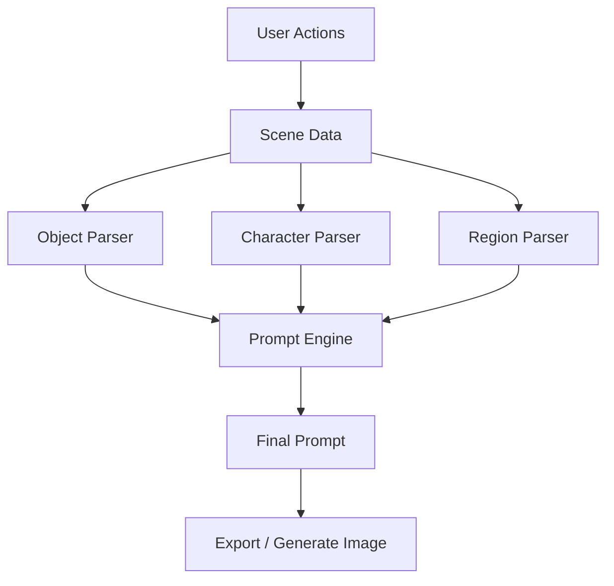
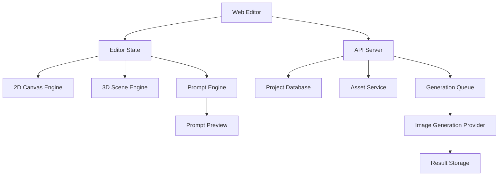

# SceneForge 设计文档

## 1. 项目概述

SceneForge 是一个可视化 Prompt 创作工具，目标是让用户通过场景构建、人物构建和提示词选取的方式，更直观地创建用于 AI 图像生成的 prompt。

用户不需要从空白文本开始描述画面，而是可以像搭建分镜、舞台或概念草图一样完成画面设计：放置场景物体、调整人物姿态、给不同区域添加描述标签，最后由系统自动组合成结构化 prompt。

项目核心不是单纯提供一个 prompt 输入框，而是构建一个“可视化语义编辑器”。用户通过场景、人物、区域和局部部位表达画面内容，系统再将这些结构化信息转换成高质量 prompt。

## 2. 核心目标

### 2.1 产品目标

1. 降低 AI 绘图 prompt 编写门槛。
2. 让用户通过可视化方式表达构图、场景、人物、姿态和局部细节。
3. 支持 2D / 3D 两种创作模式。
4. 支持场景对象和人物部位级别的提示词选择。
5. 自动生成清晰、可编辑、可复用的 prompt。
6. 为后续接入 Stable Diffusion、Midjourney、ComfyUI、Flux 等模型预留扩展能力。

### 2.2 用户目标

用户可以完成如下流程：

1. 选择画布比例和创作模式。
2. 拖入场景对象，例如房间、桌子、窗户、树、月亮等。
3. 使用简单几何图形代替复杂模型，并为其添加文字描述。
4. 拖入人物骨架或人物模型。
5. 调整人物头部、躯干、手臂、腿部的位置和姿态。
6. 对场景不同区域、人物不同部位添加 prompt 标签。
7. 自动生成最终 prompt。
8. 手动编辑、保存、导出或发送给图像生成服务。

## 3. 目标用户与使用场景

### 3.1 目标用户

- AI 绘图创作者
- 插画师、设计师
- 分镜师、漫画创作者
- 游戏美术概念设计师
- 不熟悉英文 prompt 的普通用户

### 3.2 使用场景

- 生成角色立绘
- 生成复杂场景图
- 生成漫画分镜
- 生成游戏概念图
- 生成产品海报背景
- 生成人物动作参考图

## 4. 核心功能范围

### 4.1 可视化场景构建

系统提供一个可交互画布，用户可以在画布中放置场景元素。

支持两种模式：

- 2D 模式：类似平面设计工具，用户拖拽图形、调整大小、旋转、层级和文字描述。
- 3D 模式：类似简化 3D 舞台，用户可放置基础模型、调整位置、旋转、缩放、相机和光源。

### 4.2 场景对象

MVP 阶段不强依赖复杂 3D 模型，可以先使用“图形 + 描述”的方式表达对象。

支持对象类型：

- 矩形
- 圆形
- 椭圆
- 多边形
- 线条
- 图片占位物
- 3D 基础体：立方体、球体、圆柱、平面
- 预设场景对象：房间、窗户、桌子、椅子、树、山、云、太阳等

每个对象可配置：

- 名称
- 描述文本
- Prompt 标签
- 位置
- 尺寸
- 旋转
- 层级
- 材质 / 颜色
- 是否参与最终 prompt
- 权重

示例：

```text
用户拖入一个矩形，写上 wooden table。
系统可以理解为 a wooden table in the foreground。
```

## 5. 人物构建系统

### 5.1 人物模型类型

人物模型分为两个阶段实现。

### 5.2 MVP：2D 骨架人物

使用简化骨架表示人物：

- 头部：圆形
- 躯干：线段或矩形
- 上臂、前臂
- 大腿、小腿
- 手、脚
- 关节点：脖子、肩膀、手肘、手腕、髋部、膝盖、脚踝

用户可以拖动关节点改变姿态。

### 5.3 进阶版：3D 人体骨架

使用简化 3D 骨架或低模人体：

- 支持旋转视角
- 支持骨骼 IK
- 支持姿态预设
- 支持镜像动作
- 支持动作库，例如站立、坐下、奔跑、跳跃、战斗姿势等

## 6. 局部 Prompt 选择系统

局部 Prompt 选择是项目的核心差异化能力。

用户可以对画面中的不同对象、人物部位、空间区域添加提示词。

### 6.1 场景对象级 Prompt

示例：

对象：窗户

```text
large window
sunlight through window
rainy outside
cyberpunk city outside
soft light
```

对象：桌子

```text
wooden table
messy desk
books on table
warm candle light
```

### 6.2 人物部位级 Prompt

人物部位包括：

- 头部
- 头发
- 脸
- 眼睛
- 上半身
- 手臂
- 手
- 腿
- 服装
- 鞋子
- 姿态
- 表情

示例：

头部可选择：

```text
long hair
silver hair
smiling face
blue eyes
looking at viewer
```

手部可选择：

```text
holding a sword
open hand
pointing forward
hands behind back
```

腿部可选择：

```text
crossed legs
running pose
kneeling
standing naturally
```

### 6.3 区域级 Prompt

用户可以框选画布区域，对该区域添加描述。

例如：

- 左上角：moon in the sky
- 背景：misty forest
- 前景：flowers and grass
- 右侧：ancient stone gate

系统需要将这些空间关系转换为 prompt：

```text
a moon in the upper left sky, misty forest in the background, flowers and grass in the foreground
```

## 7. Prompt 生成逻辑

### 7.1 Prompt 组成结构

最终 prompt 建议按以下顺序生成：

```text
[主体描述],
[人物描述],
[姿态描述],
[服装与细节],
[场景描述],
[空间关系],
[光照],
[风格],
[镜头与构图],
[质量词]
```

示例：

```text
a young woman with long silver hair and blue eyes, standing in a relaxed pose, wearing a white fantasy dress, in a moonlit forest, ancient stone gate on the right, flowers in the foreground, soft cinematic lighting, anime style, highly detailed
```

### 7.2 数据到 Prompt 的转换

系统内部将画布中的对象转换为结构化数据，再由 Prompt Engine 生成文本。



### 7.3 空间关系推断

系统可以根据对象位置推断描述词：

- 靠上：upper area / in the sky
- 靠下：foreground / ground
- 靠左：on the left
- 靠右：on the right
- 面积大：dominant / large
- 靠近人物：near the character
- 在人物后方：behind the character
- 在人物前方：in front of the character

例如：

```text
画布中月亮位于左上角，系统生成 a moon in the upper left sky。
```

## 8. 交互流程

### 8.1 创建项目

用户进入后选择：

- 画布比例：1:1、4:3、16:9、9:16、3:4
- 创作模式：2D / 3D
- 风格模板：写实、动漫、电影感、概念设计、像素风等
- 输出模型：Stable Diffusion / Midjourney / Flux / 通用 Prompt

### 8.2 搭建场景

用户从左侧素材面板拖入对象：

- 基础图形
- 场景预设
- 人物模型
- 道具
- 光源
- 相机

拖入后可在右侧属性面板编辑：

- 对象名称
- 描述
- Prompt 标签
- 位置
- 尺寸
- 层级
- 权重

### 8.3 搭建人物

用户拖入人物模型后：

- 拖动关节点调整姿势
- 选择姿态模板
- 调整朝向
- 设置人物描述
- 为不同部位添加 prompt

### 8.4 选择提示词

用户点击对象或人物部位后，右侧出现提示词面板：

- 推荐提示词
- 常用提示词
- 自定义提示词
- 权重调节
- 正向 / 负向提示词选择

### 8.5 生成 Prompt

点击生成后，系统展示：

- 自动生成 Prompt
- Negative Prompt
- Prompt 分段结构
- 可手动编辑文本
- 可复制
- 可保存为模板
- 可发送到图像生成接口

## 9. 界面设计

### 9.1 主界面布局

```text
┌────────────────────────────────────────────┐
│ 顶部工具栏：保存 / 导出 / 模式切换 / 生成图 │
├───────────────┬────────────────┬───────────┤
│ 左侧素材面板   │ 中央画布        │ 右侧属性面板 │
│ 图形           │ 2D/3D 编辑区    │ 对象属性     │
│ 场景           │                │ Prompt 标签  │
│ 人物           │                │ 权重设置     │
│ 道具           │                │              │
├───────────────┴────────────────┴───────────┤
│ 底部 Prompt 面板：生成结果 / Negative Prompt │
└────────────────────────────────────────────┘
```

### 9.2 左侧素材面板

包含：

- 基础图形
- 场景元素
- 人物模型
- 道具
- 光源
- 相机
- 已保存模板

### 9.3 中央画布

2D 模式支持：

- 拖拽
- 缩放
- 旋转
- 对齐线
- 图层
- 框选
- 多选
- 快捷键

3D 模式支持：

- 轨道视角
- 拖拽放置
- 三轴移动
- 旋转
- 缩放
- 地面网格
- 相机预览

### 9.4 右侧属性面板

根据选中对象动态变化。

场景对象属性：

- 名称
- 对象描述
- Prompt 标签
- 颜色
- 尺寸
- 位置
- 层级
- 权重

人物部位属性：

- 部位名称
- 当前姿态
- 部位 Prompt
- 推荐词
- 自定义词
- 权重

## 10. 数据模型设计

### 10.1 项目数据结构

```ts
type Project = {
  id: string;
  name: string;
  mode: "2d" | "3d";
  canvas: CanvasConfig;
  sceneObjects: SceneObject[];
  characters: Character[];
  regions: PromptRegion[];
  globalPrompt: PromptConfig;
  createdAt: string;
  updatedAt: string;
};
```

### 10.2 场景对象

```ts
type SceneObject = {
  id: string;
  type: "rect" | "circle" | "polygon" | "cube" | "sphere" | "custom";
  name: string;
  description: string;
  position: Vector2 | Vector3;
  rotation: Vector2 | Vector3;
  scale: Vector2 | Vector3;
  layer: number;
  promptTags: PromptTag[];
  weight: number;
  visible: boolean;
};
```

### 10.3 人物数据

```ts
type Character = {
  id: string;
  name: string;
  position: Vector2 | Vector3;
  rotation: Vector2 | Vector3;
  scale: Vector2 | Vector3;
  skeleton: Skeleton;
  bodyParts: BodyPart[];
  promptTags: PromptTag[];
};
```

### 10.4 人物部位

```ts
type BodyPart = {
  id: string;
  name:
    | "head"
    | "hair"
    | "face"
    | "eyes"
    | "torso"
    | "leftArm"
    | "rightArm"
    | "leftHand"
    | "rightHand"
    | "leftLeg"
    | "rightLeg"
    | "feet";
  promptTags: PromptTag[];
  transform: Transform;
};
```

### 10.5 Prompt 标签

```ts
type PromptTag = {
  id: string;
  text: string;
  category:
    | "subject"
    | "scene"
    | "pose"
    | "clothing"
    | "lighting"
    | "style"
    | "camera"
    | "quality"
    | "negative";
  weight: number;
  enabled: boolean;
};
```

## 11. 系统架构

### 11.1 前端架构

推荐使用 Web 技术实现：

- React / Next.js
- TypeScript
- Zustand 或 Redux Toolkit
- Konva.js / Fabric.js 用于 2D 画布
- Three.js / React Three Fiber 用于 3D 场景
- Tailwind CSS 或 shadcn/ui 用于 UI
- Next.js API + 本机磁盘目录（默认 `<项目根>/data/projects`，可由环境变量配置）用于本地草稿
- 后端 API 用于项目保存、模板同步、图像生成

### 11.2 后端架构

后端职责：

- 用户项目管理
- Prompt 模板管理
- 素材库管理
- 图像生成任务管理
- 第三方模型 API 适配
- 用户账户与权限
- 云端保存与版本历史

推荐技术：

- Node.js + NestJS
- PostgreSQL
- Redis
- S3 / R2 / OSS 对象存储
- Queue 系统，例如 BullMQ
- WebSocket 用于生成任务进度推送

### 11.3 架构图



## 12. Prompt 词库设计

### 12.1 词库分类

Prompt 词库按类别组织：

- 人物主体
- 发型
- 五官
- 表情
- 姿态
- 服装
- 场景
- 光照
- 色彩
- 风格
- 镜头
- 构图
- 画质
- 负向提示词

### 12.2 推荐逻辑

系统根据当前选中的对象推荐相关提示词。

选中头发：

```text
long hair
short hair
silver hair
curly hair
braided hair
wind-blown hair
```

选中天空区域：

```text
blue sky
night sky
cloudy sky
starry sky
sunset sky
dramatic clouds
```

选中手部：

```text
holding sword
holding flower
open hand
pointing
reaching out
```

## 13. 权重系统

用户可以为 prompt 标签设置权重。

Stable Diffusion 格式示例：

```text
(long hair:1.2), (blue eyes:1.1), (cinematic lighting:1.3)
```

系统应支持：

- 普通权重
- 强调权重
- 弱化权重
- 禁用某个标签
- Negative Prompt

不同模型格式可能不同：

Stable Diffusion：

```text
(long hair:1.2)
```

Midjourney：

```text
long hair::1.2
```

因此 Prompt Engine 需要支持多模型格式转换。

## 14. 保存与导出

### 14.1 项目保存

保存内容包括：

- 画布配置
- 场景对象
- 人物姿态
- Prompt 标签
- 模板设置
- 生成历史

### 14.2 文件导入导出（MVP）

- 画布 JSON：场景、物体、人物骨架与画布上的 Prompt 标签。
- 词库 JSON：自定义词库与隐藏的内置词条 id。

其它格式（如完整项目 JSON、ComfyUI 参数等）列入后续版本。

## 15. MVP 范围

第一阶段建议聚焦在“2D 可视化 Prompt 编辑器”。

### 15.1 MVP 必做功能

1. 2D 画布编辑器。
2. 基础图形拖拽、缩放、旋转。
3. 图形文字描述。
4. 人物 2D 骨架。
5. 人物关节点拖拽。
6. 对人物部位添加 prompt。
7. 对场景对象添加 prompt。
8. Prompt 词库面板。
9. 自动生成 prompt。
10. 保存项目到本地。
11. 复制 prompt。

### 15.2 MVP 暂不做

- 完整 3D 人体模型
- 高级 IK 系统
- 多人复杂交互
- 完整图像生成云服务
- 协作编辑
- 商业素材市场

## 16. 后续版本规划

### V1：完整 2D 编辑器

- 完善 2D 场景搭建
- 人物骨架编辑
- Prompt 标签系统
- 本地保存
- Prompt 导出

### V2：3D 场景模式

- Three.js 3D 编辑器
- 基础 3D 模型
- 3D 人物骨架
- 相机视角
- 光源配置

### V3：图像生成集成

- 接入 Stable Diffusion / ComfyUI
- 生成任务队列
- 生成历史
- 参数配置
- 图像对比

### V4：智能辅助

- 根据画布自动补全 prompt
- AI 推荐场景描述
- AI 修复 prompt 语法
- 从图片反推场景结构
- 从文字生成初始场景布局

### V5：社区与模板

- Prompt 模板市场
- 场景模板分享
- 人物姿态库
- 风格预设库

## 17. 技术难点

### 17.1 人物姿态表达

难点：

- 2D 骨架拖拽需要自然
- 关节限制需要合理
- 姿态需要转化成 prompt 语言

解决方案：

- MVP 使用简单骨架点位
- 提供姿态预设
- 不强行从骨架精确推断动作，允许用户补充姿态标签

### 17.2 可视化布局到 Prompt 的转换

难点：

- 图形位置不一定能准确表达语义
- 用户描述可能不完整
- 空间关系容易生成错误

解决方案：

- 用户对象必须有名称或描述
- 系统只做基础空间推断
- Prompt 结果始终允许用户手动编辑

### 17.3 2D 与 3D 数据统一

难点：

- 2D 和 3D 坐标系统不同
- 对象类型不同
- Prompt 生成逻辑需要共用

解决方案：

- 抽象统一 SceneObject 数据结构
- 2D 使用 Vector2，3D 使用 Vector3
- Prompt Engine 只消费语义数据，不直接依赖渲染引擎

## 18. 推荐技术选型

### 18.1 前端

```text
Next.js
React
TypeScript
Konva.js
React Three Fiber
Zustand
Tailwind CSS
shadcn/ui
```

### 18.2 后端

```text
Node.js
NestJS
PostgreSQL
Redis
BullMQ
S3/R2
WebSocket
```

### 18.3 AI / 图像生成接口

```text
Stable Diffusion WebUI API
ComfyUI API
Replicate API
OpenAI Image API
Flux API
Midjourney Prompt Export
```

## 19. 示例用户流程

### 示例：创建一张“森林中的魔法少女”图片

1. 用户选择 16:9 画布。
2. 拖入背景区域，描述为 `misty forest`。
3. 拖入圆形到左上角，描述为 `full moon`。
4. 拖入人物骨架，调整为站立姿势。
5. 点击头发，选择 `long silver hair`。
6. 点击眼睛，选择 `blue eyes`。
7. 点击服装，选择 `white fantasy dress`。
8. 点击右手，选择 `holding a magic staff`。
9. 添加全局风格：`anime style`、`cinematic lighting`、`highly detailed`。
10. 系统生成：

```text
a young magical girl with long silver hair and blue eyes, standing in a misty forest, wearing a white fantasy dress, holding a magic staff in her right hand, full moon in the upper left sky, soft cinematic lighting, anime style, highly detailed
```

## 20. 成功指标

### 20.1 产品指标

- 用户能在 5 分钟内完成一个完整 prompt。
- 用户不需要手写大段 prompt 也能生成可用结果。
- 生成 prompt 的可编辑性强。
- 用户愿意复用场景模板和人物姿态。

### 20.2 技术指标

- 画布操作流畅，基础操作保持 60 FPS。
- 项目数据可稳定保存和恢复。
- Prompt 生成结果结构清晰。
- 2D 与 3D 模块可以逐步扩展。

## 21. 里程碑计划

### 阶段 1：产品原型

- 完成主界面布局。
- 完成 2D 画布基础操作。
- 支持矩形、圆形、文字描述。
- 支持对象属性面板。
- 支持基础 prompt 生成。

### 阶段 2：人物骨架

- 实现 2D 人物骨架。
- 支持关节点拖动。
- 支持姿态预设。
- 支持人物部位 prompt 标签。

### 阶段 3：Prompt 词库

- 建立内置词库。
- 支持按对象类型推荐提示词。
- 支持自定义标签。
- 支持权重和 negative prompt。

### 阶段 4：项目保存与导出

- 支持本地保存。
- 支持 JSON 导出。
- 支持 prompt 复制。
- 支持场景截图。

### 阶段 5：3D 扩展

- 引入 Three.js / React Three Fiber。
- 支持基础 3D 场景对象。
- 支持相机与光源。
- 逐步实现 3D 人物骨架。

## 22. 总结

SceneForge 通过可视化场景编辑、人物姿态构建和局部 prompt 标签系统，把抽象的 prompt 写作过程变成更直观的画面设计过程。

建议优先实现 2D MVP：基础场景搭建、人物骨架、局部提示词选择和 prompt 生成。待核心交互验证后，再扩展 3D 场景、AI 自动推荐、图像生成集成和模板生态。
