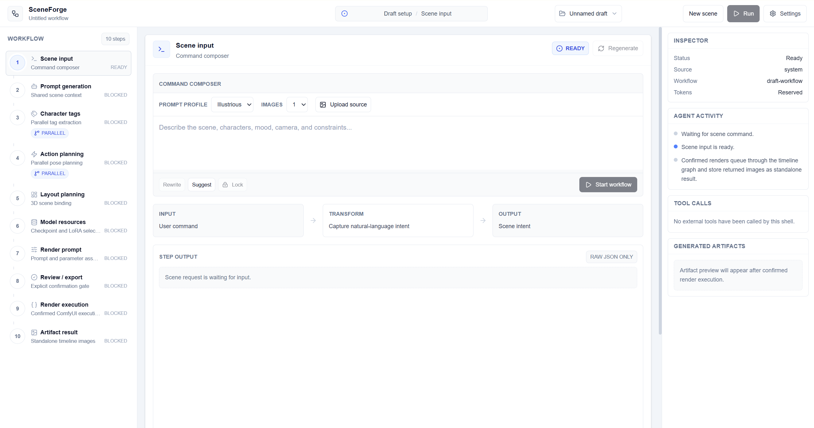
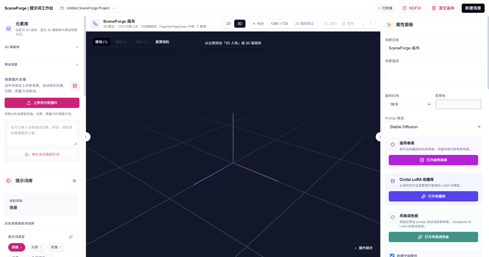

# SceneForge

SceneForge is a local-first visual prompt workspace for AI image generation.

The current MVP direction is a single-image, top-to-bottom timeline driven by LangGraph. Users enter one scene request, then review and edit scene prompt, character tags, 3D pose/canvas binding, checkpoint/LoRA selection, generation parameters, and the final ComfyUI generation gate.

## Screenshots

Timeline workflow:



Visual editor:



## Getting Started

Install dependencies and start the development server:

```bash
npm install
npm run dev
```

Open [http://localhost:3000](http://localhost:3000) with your browser. The timeline MVP is the root route.
The legacy visual editor remains available at [http://localhost:3000/editor](http://localhost:3000/editor).
The Story Graph planning surface is available at [http://localhost:3000/story](http://localhost:3000/story). It accepts a story request and optional shot count, supports AI suggest/rewrite for the request, and asks AI to choose the shot count when the field is left blank. It creates an inspectable `story-graph` workflow, supports confirmation-gated shot execution, and autosaves Story Graph state through the same local workflow record storage used by Run. Audience rating is derived internally from the Settings NSFW switch.

After importing or changing local Civitai model/LoRA metadata, rebuild the derived FTS search index and then the derived sqlite-vec embedding index used by recommendation ranking:

```bash
npm run civitai:reindex
npm run civitai:reindex-embeddings
```

Both commands read `SCENEFORGE_SQLITE_FILE` from the shell environment first, then from `.env.local` or `.env`, and otherwise use `data/sceneforge.sqlite`. `npm run civitai:reindex` rebuilds only the derived Civitai FTS index and does not rewrite original Civitai resource rows. `npm run civitai:reindex-embeddings` requires the FTS index to already exist, reads `LITELLM_BASE_URL`, optional `LITELLM_API_KEY`, and `LITELLM_CIVITAI_EMBEDDING_MODEL`, then rebuilds only derived chunked vector tables/metadata from the full FTS source text. Run both again after importing or modifying Civitai resources so recommendations do not use stale indexes.

## Continuous Integration

GitHub Actions runs the CI workflow on pull requests and pushes to `master`.
It can also be run manually from the Actions tab.
The workflow uses Node.js 22.x with the committed `package-lock.json`, then runs:

```bash
npm ci
npm run lint
npm run typecheck
npm test
npm run build
```

## MVP Workflow

The MVP starts with only a scene input, a start button, and a settings entry point. After the user submits the scene request, SceneForge expands a vertical timeline:

1. Scene prompt inference.
2. Character tag inference.
3. Character action and 3D pose inference.
4. 3D canvas binding.
5. Checkpoint and LoRA recommendation.
6. Generation parameter recommendation.
7. Start image generation gate.
8. Confirmed single-image ComfyUI execution.
9. Result display.

Every node exposes manual controls and an AI retry/suggestion action. User edits mark dependent downstream nodes stale and LangGraph regenerates only those dependent nodes. The timeline must stop before ComfyUI execution until the user explicitly clicks start image generation.

The active timeline workflow is autosaved locally. After a workflow has started, SceneForge restores the active workflow when you visit Settings and return, or when you reload the Run page and the active record is still available. Interrupted running nodes restore as visible retryable errors rather than pretending background work continued while the page was away. The Run header also includes a workflow project menu for saved timeline workflows: save the current active draft as a named workflow, open a saved workflow, rename it, refresh the list, or delete saved workflow records.

## LLM API

SceneForge exposes a server-side LiteLLM chat endpoint at `POST /api/llm/chat`. Existing AI features use this endpoint for prompt, tag, pose, diagnosis, enrichment, and recommendation flows. Timeline work should reuse these interfaces through graph-friendly adapters before adding any new LLM route.

Configure the LiteLLM proxy with server-only environment variables:

```bash
LITELLM_BASE_URL=http://localhost:4000
LITELLM_API_KEY=your-litellm-proxy-key
LITELLM_DEFAULT_MODEL=your-model-name
LITELLM_NSFW_MODEL=optional-nsfw-model
SCENEFORGE_SHOW_NSFW_BUTTON=false
LITELLM_CIVITAI_RECOMMENDATION_MODEL=optional-civitai-recommendation-model
LITELLM_CIVITAI_EMBEDDING_MODEL=required-civitai-embedding-model
```

The endpoint accepts `model`, `messages`, `temperature`, `maxTokens`, and optional `nsfw`. Requests marked `nsfw` use `LITELLM_NSFW_MODEL` when it is configured before forwarding to LiteLLM's OpenAI-compatible `/v1/chat/completions` API. Civitai semantic candidate retrieval requires `LITELLM_CIVITAI_EMBEDDING_MODEL` through LiteLLM's `/v1/embeddings` API during `npm run civitai:reindex-embeddings` and recommendation requests. Long Civitai source text is embedded in overlapping chunks, and recommendation ranking uses each resource's nearest chunk. Timeline model-resource and render-parameter recommendation nodes keep their purpose-specific models.

## Settings

The MVP settings page should centralize configuration outside the main timeline:

- NSFW mode.
- Project storage path.
- Prompt library path.
- Generated image storage path.
- ComfyUI temp directory path.
- Civitai LoRA, checkpoint, diffusion model, and ControlNet resource paths and status.
- ComfyUI connection status.
- LiteLLM configuration status.

Secrets should remain server-only in `.env.local` unless a later scoped issue adds secure runtime secret editing. The settings UI may display whether a secret is configured, but must not echo secret values.

## Local Data

Runtime data is stored under `data/` by default or in configured absolute paths. Do not commit generated projects, logs, caches, databases, downloaded assets, or generated images.

SQLite-backed settings and Civitai metadata use `data/sceneforge.sqlite` by default. Set `SCENEFORGE_SQLITE_FILE` to an absolute path to override the database location. `npm run civitai:reindex` and `npm run civitai:reindex-embeddings` use the same value from the shell, `.env.local`, or `.env`.

Timeline workflow records are stored under `data/timeline-workflows/` by default. The active autosave record remains `active-workflow.json`; named workflow records are separate JSON files in the same directory. Records can hold either `single-image` Run workflows or `story-graph` workflows. They contain local workflow state and references needed to restore progress; they must not contain API keys, `.env.local` secret values, generated image bytes, downloaded models, caches, logs, or local resource databases. Deleting a named workflow removes only that workflow JSON record and does not delete generated images or external assets referenced by the workflow.

Important environment variables are documented in `.env.example`.

## Privacy and Local Logs

SceneForge is designed for local use. The LiteLLM route writes local request, response, and error records to `data/logs/llm-chat.jsonl` by default. These records can include scene prompts, user text, image data URLs, model responses, and diagnostic details. The log directory is ignored by git, but users should still treat it as private local data.

To disable LLM local logging, set:

```bash
SCENEFORGE_LLM_LOG_FILE=off
```

To clear existing logs, delete `data/logs/llm-chat.jsonl` or the custom file configured by `SCENEFORGE_LLM_LOG_FILE`.

## Third-Party Services and Content

SceneForge can connect to local or user-configured services such as LiteLLM, ComfyUI, Tavily, Civitai, and artist-string source pages. Users are responsible for complying with each service's terms, model licenses, content policies, and applicable law. The repository does not distribute generated images, downloaded models, LoRAs, checkpoints, Civitai caches, prompt-library runtime data, or local project files.

Do not expose the development server directly to the public internet without adding authentication, authorization, rate limiting, path isolation, and a deployment-specific review of the local file and integration routes.

## License

SceneForge is released under the MIT License. See `LICENSE`.

Third-party dependency license inventory is maintained in `docs/third-party-licenses.md`.

## Documentation

Product and technical planning lives in:

- `docs/product-vision.md`
- `docs/product-spec.md`
- `docs/tech-spec.md`
- `docs/plan.md`
