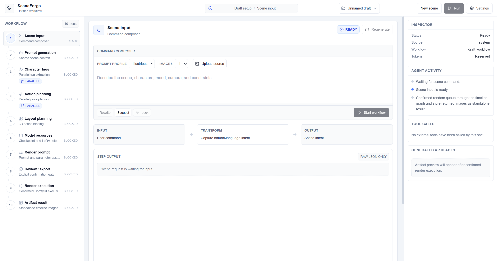
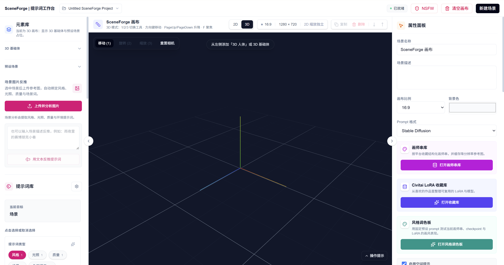

# SceneForge

SceneForge is a local-first visual prompt workspace for AI image generation.

The current MVP direction is a single-scene, top-to-bottom Run timeline driven by LangGraph. Users enter one scene request, then review and edit scene prompt, character tags, 3D pose/canvas binding, checkpoint/LoRA selection, generation parameters, FaceDetailer, HandDetailer, and the final ComfyUI generation gate. Both text-to-image and img2img Runs deliver 1-4 selected final images.

## Screenshots

Timeline workflow:



Visual editor:



## Getting Started

Install dependencies and start the development server:

```bash
npm install
npm run dev
```

Open [http://localhost:3000](http://localhost:3000) with your browser. The timeline MVP is the root route.
The legacy visual editor remains available at [http://localhost:3000/editor](http://localhost:3000/editor).
The Story Graph planning surface is available at [http://localhost:3000/story](http://localhost:3000/story). It accepts a story request, optional shot count, optional explicit checkpoint/LoRA style resources, and one optional global style reference image. The style reference is uploaded through the existing sequence-reference storage route, analyzed with LiteLLM vision chat into base-model-compatible reusable style prompt text, and appended as a complete prompt segment to every final or regenerated Story shot. The Core Settings Illustrious base model exposes IPAdapter `weight`, `start_at`, and `end_at` controls from 0 to 1; Anima and unsupported selected checkpoints use the analyzed prompt only. After a checkpoint is selected, the Story Parameters dialog can generate AI Style Advice for the selected resources and save ComfyUI generation parameters. Saved Story style resources bypass the `resource-plan` LLM, saved Story generation parameters bypass the `parameter-plan` LLM, and render-prompt planning can still use AI. It supports AI suggest/rewrite for the request and asks AI to choose the shot count when the field is left blank. It creates an inspectable `story-graph` workflow, supports confirmation-gated shot execution, and autosaves Story Graph state through the same local workflow record storage used by Run. The Story header includes a workflow project menu for opening saved Story Graph workflows before entering a node and for saving named workflows after planning starts. Audience rating is derived internally from the Settings NSFW switch.

Civitai image import accepts a numeric image ID or an `/images/<id>` page on `civitai.com`, `www.civitai.com`, `civitai.red`, or `www.civitai.red`. The page URL is used only to extract the numeric ID, and the fixed Civitai API lookup always includes `nsfw=X` so explicit metadata imports are not filtered by SceneForge generation settings. Import does not change or authorize NSFW behavior in Run, Story, Editor generation, LiteLLM routing, or ComfyUI.

Confirmed Civitai imports keep recommendation indexes current automatically. Parse preview is read-only. A new selected model or LoRA is embedded in bounded LiteLLM batches and becomes available to BM25 and semantic recommendation immediately after one atomic database commit; linking an image to an existing resource does not overwrite or re-embed that resource. Confirmed reanalysis follows the same rule and embeds only when its deterministic recommendation search text changed.

Incremental indexing requires `LITELLM_CIVITAI_EMBEDDING_MODEL` and a healthy compatible FTS/sqlite-vec baseline. The first import may initialize both indexes only when the model/LoRA library is genuinely empty. For a nonempty library with missing, stale, legacy, or incompatible indexes—or after changing the embedding model, vector dimensions, schema, chunk size, or overlap—repair the complete derived indexes with:

```bash
npm run civitai:reindex
npm run civitai:reindex-embeddings
```

Both commands read `SCENEFORGE_SQLITE_FILE` from the shell environment first, then from `.env.local` or `.env`, and otherwise use `data/sceneforge.sqlite`. `npm run civitai:reindex` rebuilds only the derived Civitai FTS index and does not rewrite original Civitai resource rows. `npm run civitai:reindex-embeddings` requires the FTS index to already exist, reads `LITELLM_BASE_URL`, optional `LITELLM_API_KEY`, and `LITELLM_CIVITAI_EMBEDDING_MODEL`, then rebuilds only derived chunked vector tables/metadata from the full FTS source text. These commands remain the explicit repair and configuration-change path, not an ordinary post-import step.

## Continuous Integration

GitHub Actions runs the CI workflow on pull requests and pushes to `master`.
It can also be run manually from the Actions tab.
The workflow uses Node.js 22.x with the committed `package-lock.json`, then runs:

```bash
npm ci
npm run lint
npm run typecheck
npm test
npm run build
```

## MVP Workflow

The MVP starts with a Scene Composer, a start button, and a settings entry point. The Composer can optionally select ready local checkpoint/LoRA resources, save supported ComfyUI parameters with user-triggered AI Style Advice, configure independent FaceDetailer and HandDetailer settings, and attach an img2img source. After the user submits the scene request, SceneForge expands a vertical timeline:

1. Scene prompt inference.
2. Character tag inference.
3. Character action and 3D pose inference.
4. 3D canvas binding.
5. Checkpoint and LoRA recommendation.
6. Generation parameter recommendation.
7. Start image generation gate.
8. Confirmed model-family Balanced preview generation at up to longest-edge 768.
9. Structured Vision scoring and Top-K selection.
10. Full-resolution img2img second-pass execution.
11. Paired Preview/Final Vision review.
12. Optional one-shot local Final repair and bounded verification.
13. User-selectable result display.

Every node exposes manual controls and an AI retry/suggestion action. User edits mark dependent downstream nodes stale and LangGraph regenerates only those dependent nodes. The timeline must stop before ComfyUI execution until the user explicitly clicks start image generation.

Empty-input Run Suggest uses a dedicated six-candidate LiteLLM request. Each candidate supplies one complete LLM-authored `sceneRequest`, explicit prompt-profile compatibility, and bounded concept fingerprints for protagonist, age, occupation, setting, era, action, tone, and palette. SceneForge validates and ranks those structured fields against the current batch and at most 20 recent local fingerprints, then makes the only random decision as a 50/30/20 weighted choice among the ranked top three. After the single permitted schema-repair call, two candidates use 62.5/37.5, one is selected directly, and zero leaves the Composer unchanged with a retryable error. The selected `sceneRequest` is used intact except outer whitespace trimming; it is never assembled or enriched from fingerprint labels. Nonempty Suggest and Rewrite continue using their existing request, response, temperature, and workflow-staling path in both Simple and Detailed mode.

Every empty-input candidate must depict exactly one person as the sole visual subject, with no multi-person, additional-person, couple, group, crowd, or background-person scene. When Settings NSFW is disabled, that sole protagonist must be female; the batch uses diverse safe settings, with campus available only as one optional possibility rather than a requirement or default, and no 21+ declaration is imposed. When Settings NSFW is enabled, the same initial request and single repair instead ask all six candidates to lean clearly adult and NSFW with varied mature intensity without requiring the sole protagonist to be female. That sole person must be explicitly 21 or older, and each candidate's existing `ageGroup` fingerprint must contain an unambiguous numeric 21+ declaration before that candidate can enter ranking. The NSFW prompt prohibits minors, ambiguous-age or youth-coded subjects and settings, coercion, exploitation, non-consensual sexual content, and unlawful sexual content. Person count, background-person exclusion, and SFW protagonist gender remain request-contract instructions because existing fingerprints do not encode those facts reliably; SceneForge does not keyword-parse or rewrite `sceneRequest`, extend history, or change ranking to infer them. NSFW requests continue using `LITELLM_NSFW_MODEL` with `LITELLM_DEFAULT_MODEL` fallback.

Suggestion diversity history is installation-local at `data/agent-timeline-run-suggestion-history/history.json`, separate from workflow autosave and ignored by Git. It retains only the newest 20 versioned selected/not-selected fingerprint records and timestamps—never scene prompts, raw model responses, reasoning, resources, secrets, or assets. Missing, corrupt, oversized, or unreadable history is treated as empty. A write failure does not discard a valid suggestion and is shown as a nonblocking warning. This privacy-bounded history is distinct from configured LiteLLM diagnostic logs, which retain their existing logging policy; Suggest does not access Civitai FTS, sqlite-vec, ComfyUI, or generated assets.

Except for the corrected Krea2 ReID path described below, the shared staged Run rules are as follows. Explicit Composer resources bypass the resource-recommendation provider. Saved Composer parameters require an explicit checkpoint and bypass automatic parameter advice; leaving parameters unsaved preserves the automatic path. Changing checkpoint or LoRAs clears saved parameters and prior Style Advice. After a Run starts, resource changes stale from resource recommendation, while parameter or Detailer changes stale from parameter recommendation; both cancel prior confirmation without discarding completed prompt, tag, pose, or canvas work. Detailers are user-controlled only and are never sent to AI planning. Both text-to-image and img2img keep the selected 1-4 final output count. A Run generates 4/4/6/8 independent previews for K=1/2/3/4, scores them with one high-detail comparative Vision request, and renders the selected K previews at formal dimensions. Scoring uses transient in-memory JPEG copies at quality 85 and longest edge at most 768 to bound the 4/6/8-image request; managed preview files remain unchanged. Before each Final is queued, the selected managed Preview is deterministically resized with server-side Lanczos3 to the exact formal dimensions without crop, padding, aspect-ratio rounding, or stretch and stored as a candidate-linked managed fallback. This `preview-upscale` artifact is the Final's sole img2img source. Balanced preview policy uses exact-aspect, 8-pixel-aligned dimensions with longest edge up to 768 and never upscales smaller inputs; unsupported extreme ratios fail before preview generation instead of being stretched. Every Run profile uses up to 20 preview steps, bounded by the formal step count. Composer Final redraw strength defaults to Balanced and resolves by model family: Conservative uses 0.30 Illustrious / 0.35 Anima or fallback, Balanced uses 0.40 / 0.45, and Strong uses 0.50 / 0.55 with a visible structural-drift warning. Changing only this preset cancels confirmation but preserves a valid Preview pool, scoring selection, and seed so reconfirmation resumes from Final; prior Finals from another preset are never reused. Initial fixed-seed previews start at the formal seed, while each explicit preview retry advances by one full candidate window with safe wraparound; random-seed Runs continue drawing a fresh base seed. Vision returns only defect-category strings and scores; SceneForge tolerantly normalizes known category variants and numeric strings, derives eligibility locally, and uses one bounded schema-repair retry without storing raw model output. Blocking eligibility is intentionally rare: only unusable anatomy/structure, unmistakable physical impossibility, or catastrophic exposure/technical corruption block a preview. Missing props or contact, character appearance differences, gaze/action mismatch, and scale/framing mismatch reduce scores and may remain visible as non-blocking annotations. Ranking is eligible-first, then uses the existing weighted score, composition, and candidate order. If fewer than K previews are eligible, SceneForge fills the exact Top-K with the highest-ranked annotated fallback candidates, shows a warning, and continues final rendering instead of failing the workflow. Detailed mode also permits an explicit exact-K fallback selection while preserving all defect annotations. Source-img2img previews use the Composer source dimensions and denoise. After all 1-4 Finals complete, one bounded high-detail request reviews every managed `preview-upscale`/Final pair. SceneForge locally recommends Preview only for a major or blocking issue introduced by Final; users can select either variant without rerunning Vision, ComfyUI, or upstream nodes. Review failure leaves both variants visible with review-only retry. A Composer checkbox, off by default and covered by generation confirmation, may authorize one automatic local repair for each Final with a major or blocking Final-introduced contact or object-count defect. SceneForge validates one structured mask before and after bounded growth, rejects empty or greater-than-35-percent masks, preserves the original Final seed, dimensions, resources, prompt, and request-local Detailers, and never retries a successful repair. A single unrotated rectangle or ellipse may request one optional SAM2 refinement after object-info compatibility checks; unavailable or invalid SAM2 output is recorded and falls back only to the already validated structured mask, never a broad mask. One bounded Preview/Final/Repair verification request computes the recommendation locally; Repair is never auto-promoted and appears only after verification for explicit user selection.

Run also exposes an independent Anime/Photoreal visual-style selector in both Simple and Detailed Composer modes; the prompt profile remains a separate model-format choice. New and continuable legacy Runs default to Anime. Changing visual style cancels confirmation and stales Scene Prompt plus every downstream node while preserving explicit checkpoint/LoRA choices, saved parameters, Detailers, source image, and the uploaded style-reference snapshot; that reference must be reanalyzed in the new style context before reuse. Suggest, Rewrite, Scene Prompt, resource recommendation, Style Advice, and style-reference analysis all receive the selected style. Local prompt compilation owns one authoritative `visualStyleAndMedium` section for Illustrious, Anima, and Krea, appends the matching minimal opposing-domain negatives, and suppresses only LLM-authored artist fields for Photoreal while retaining selected resource trigger words. Preview Vision records a separate boolean style match for every candidate. Eligibility fallback remains available only among style-matching candidates: fewer than K style matches stops before Final, and Detailed mode cannot select a mismatch. Final and Repair variants are selectable only after their own style verification; a missing, malformed, failed, or negative verification leaves the already verified formal-size Preview fallback selectable. Completed records that predate this assessment remain historical output labeled `style-unassessed` and do not trigger provider calls during restore. No new environment variables or model-routing overrides are required.

The shared Run Scene Composer accepts optional PNG, JPEG, or WEBP global style and character references. SceneForge stores each through the existing sequence-reference boundary and analyzes a style reference through LiteLLM vision into one reusable `stylePrompt` segment. The segment is appended exactly once after Run resource-aware prompt formatting, including every Krea Preview and Final request. Illustrious-capable checkpoints continue to use their existing IPAdapter paths, and Anima retains its dedicated character path. Krea separates style-image conditioning from Krea2 ReID: style-only use keeps the existing verified `krea2_style_reference.safetensors` path, while an active prepared ReID reference pauses that adapter without deleting its state or analyzed prompt. ReID is always labeled Experimental and upstream-unverified; there is no separate verified runtime tier. Metadata-valid Krea diffusion checkpoints and compatible Krea encoders, including FP8 and RedCraft combinations, remain allowed for ReID under that warning while model-difference investigation is deferred. The required topology uses exactly one `krea2_reid_rank32.safetensors` model-only LoRA at 1.0, one `Krea2OstrisEditModelPatch` with `kv_cache=true`, and one prepared RGB image. The same image and VAE feed both the positive and negative `TextEncodeKrea2OstrisEdit` nodes, and both outputs pass through `FluxKontextMultiReferenceLatentMethod(index_timestep_zero)`. It never emits generic Krea character references or `image2`. Removing ReID restores a compatible selected style adapter. Preflight and queue-time validation fail closed before storage/upload or queueing when compatible Krea resource metadata or the exact required graph, ports, edges, or values are unavailable; validation does not pin one checkpoint or encoder identity. Workflow JSON stores only the selected prepared image's managed metadata, preparation choice, descriptor, and confirmation context—not raw uploads, alternate previews, data URLs, detector tensors/paths, or temporary ComfyUI names.

Anima Run character references require `LuciferTC9527/ComfyUI-Anima_IP-Adapter`, its `AnimaIPAdapterLoader` and `AnimaIPAdapterApply` nodes, the exact `ip_adapter-Character_Reference-10.safetensors` file under `ComfyUI/models/ipadapter/`, and the SigLIP2 encoder under `ComfyUI/models/siglip2/siglip2-base-patch16-512/`. SceneForge does not ask the workflow to download SigLIP2. It preflights the dedicated nodes, all required input ports, and the exact adapter option before uploading a Run reference or queueing. Strength is limited to 0-1 and defaults to 0.8; SceneForge fixes `ref_image_size=512`, `siglip_layer=-1`, `ip_cfg_scale=4`, `ip_cfg_separate=false`, `gray_null=false`, and `use_lora=true`. Illustrious/default workflows continue to use `ComfyUI_IPAdapter_plus`; Krea continues to use only its Krea2 Ostris Edit adapter. The adapter repository documents its weights under the CircleStone Labs Non-Commercial License; verify the current upstream terms before commercial use or redistribution.

### Krea 2 Turbo staged Run profile

Krea formal planning and Preview stay locked to 8 steps, CFG 1, Euler, and simple scheduling. Style-only and prompt-only Final retain policy v3: Conservative is 4 steps at 0.12 denoise, Balanced is 4 at 0.18, and Strong is 6 at 0.28. Active ReID uses corrected policy v5: candidates fit a 1,048,576-pixel exact-aspect, 16-aligned budget, and Final reruns the selected seed from noise at formal dimensions through the required upstream-parity topology. Its managed upscale is fallback-only; redraw denoise does not apply. Composer source img2img and FaceDetailer are unavailable while ReID is active, with the prior FaceDetailer setting restored after removal. HandDetailer remains available. Repair never contains ReID LoRA, patch, descriptor, encoder, or reference image. Version-1 ReID state cannot be migrated, retried, or reused; completed older images remain historical and read-only. Illustrious, Anima, and fallback mappings remain unchanged.

Selecting a ready local Civitai resource whose base model is Krea 2 uses the dedicated `krea2` Run profile and stores the model as a diffusion model. Its prompt is rendered as one faithful natural-language paragraph in the author-recommended order: subject/mood, attributes/actions, visual style/medium, lighting/color/texture, spatial composition/framing, then selected LoRA trigger words. Quoted user text and requested media are preserved; the renderer does not invent details and deduplicates trigger words.

Without active ReID, Krea 2 Turbo follows the confirmed Preview → comparative scoring → exact-K selection → managed `preview-upscale` → Final img2img path. Both txt2img and one Composer source image support K=1–4 finals with 4/4/6/8 independent previews. When Composer parameters are unsaved, Krea uses the same resource-aware AI Style Advice path as the other Run profiles: compatible advice may supply a no-source resolution, negative-prompt additions, selected-LoRA weights, and user-facing rationale, while its returned positive prompt is ignored in favor of the local Krea renderer. Saved parameters suppress this automatic advice. Source dimensions and denoise remain authoritative for ordinary source img2img Preview. The 1024×1024 resolution is a fallback. Krea formal planning and Preview stay locked to 8 steps, CFG 1, Euler/simple sampling, and batch size 1; conflicting saved or advised sampling values cannot reach Preview. Without active ReID, policy v3 resolves the Final second pass to Conservative 4 steps/0.12 denoise, Balanced 4/0.18, or Strong 6/0.28 while reusing the selected Preview seed and managed upscale. Active ReID is txt2img-only and follows policy v5 for the separate one-megapixel Preview and formal same-seed rerender described above. Krea formal and Preview dimensions must preserve aspect ratio and be exactly 16-pixel aligned, so SceneForge rejects invalid dimensions rather than rounding or stretching them.

Krea requires compatible local `UNETLoader`, `CLIPLoader` with type `krea2`, `VAELoader` (`qwen_image_vae.safetensors`), `KSampler`, `VAEDecode`, and `SaveImage`; ordinary img2img also requires `LoadImage`, `ImageScale`, and `VAEEncode`, and optional LoRAs use `LoraLoaderModelOnly`. ReID additionally requires both reference-aware encoders and both `FluxKontextMultiReferenceLatentMethod` nodes. It may use any metadata-valid Krea diffusion checkpoint and compatible Krea encoder exposed by the current profile, including FP8 and RedCraft combinations; SceneForge does not certify one combination as verified in this correction. Install [`ostris/ComfyUI-Krea2-Ostris-Edit`](https://github.com/ostris/ComfyUI-Krea2-Ostris-Edit) at commit `7756566160c4a1b24bb1bd9f0ff3ced1a83d7547` and place `krea2_style_reference.safetensors` and/or the exact `krea2_reid_rank32.safetensors` in the LoRA directory exposed by ComfyUI. The ReID weight comes from [`yijunwang2/krea2-reid`](https://huggingface.co/yijunwang2/krea2-reid) (verified at commit `121fb0183944f1befeb712d92e9ca07d0e282088`) and has SHA-256 `a80349faee4a2d80eff9a83820cd523c74cd0bbc6039cee21fa34b084d967944`. SceneForge never downloads it. The community ReID release is unofficial and not endorsed by Krea or Ostris; its weights are distributed under the Krea 2 Community License, the accompanying pipeline code is Apache-2.0, and the Ostris custom-node code is MIT. Verify current upstream terms before use or redistribution.

Krea2 ReID preprocessing is server-only and uses the bundled [OpenCV Zoo YuNet March 2023 INT8 model](https://github.com/opencv/opencv_zoo/tree/main/models/face_detection_yunet) through `onnxruntime-node`. SceneForge verifies its SHA-256 (`321aa5a6afabf7ecc46a3d06bfab2b579dc96eb5c3be7edd365fa04502ad9294`), applies EXIF orientation and RGB normalization, detects at confidence 0.35, chooses the highest-confidence face, and presents the upstream head/shoulders crop beside the normalized original within a 384×384 total-pixel budget. If no face is found, only the normalized original is selectable with a warning. The bundled YuNet asset is MIT-licensed; its notice is in `src/features/agent-timeline/assets/YUNET_LICENSE.txt`. There is no detector download or environment variable.

ReID targets local systems such as a 12 GB RTX 4080 Laptop, but formal renders above the one-megapixel Preview budget may require ComfyUI model offload or a lower requested resolution. SceneForge shows that warning and reports memory failure recoverably; it does not silently substitute the selected model or resize the request. ReID validation is not complete from unit tests or node availability alone. Before closing the corrective gate, run four seeds on the selected experimental runtime and report candidate identity consistency plus whether the selected formal Final improves, preserves, or reduces identity. Record the checkpoint, encoder, dimensions, and memory/offload mode without treating the report as runtime certification. Keep reference and generated images local and uncommitted.

The active timeline workflow is autosaved locally. After a workflow has started, SceneForge restores the active workflow when you visit Settings and return, or when you reload the Run page and the active record is still available. Interrupted running nodes restore as visible retryable errors rather than pretending background work continued while the page was away. One-shot Repair additionally checkpoints safe per-pair queue-started/prompt/output/storage identity under `SCENEFORGE_REPAIR_ATTEMPTS_DIR` or `data/agent-timeline-repair-attempts/`, allowing history/storage recovery without queueing a second Repair. Exact matching workflow and disk checkpoints reconcile monotonically, so a known prompt, output, or stored Repair is never masked by an older disk state. An uncertain `queue-started` outcome is instead shown as closed and cannot be retried: inspect ComfyUI queue/history first, and if acceptance cannot be proven, leave that Repair closed and continue with the preserved Preview or Final. Do not delete its checkpoint or queue another Repair merely to test the outcome. The Run header also includes a workflow project menu for saved timeline workflows: save the current active draft as a named workflow, open a saved workflow, rename it, refresh the list, or delete saved workflow records.

## LLM API

SceneForge exposes a server-side LiteLLM chat endpoint at `POST /api/llm/chat`. Existing AI features use this endpoint for prompt, tag, pose, diagnosis, enrichment, and recommendation flows. Timeline work should reuse these interfaces through graph-friendly adapters before adding any new LLM route.

Configure the LiteLLM proxy with server-only environment variables:

```bash
LITELLM_BASE_URL=http://localhost:4000
LITELLM_API_KEY=your-litellm-proxy-key
LITELLM_DEFAULT_MODEL=your-model-name
LITELLM_NSFW_MODEL=optional-nsfw-model
LITELLM_VISION_MODEL=optional-vision-model
SCENEFORGE_SHOW_NSFW_BUTTON=false
LITELLM_CIVITAI_RECOMMENDATION_MODEL=optional-civitai-recommendation-model
LITELLM_CIVITAI_EMBEDDING_MODEL=required-civitai-embedding-model
```

The endpoint accepts `model`, `messages`, `temperature`, `maxTokens`, and optional `nsfw`. Requests marked `nsfw` generally use `LITELLM_NSFW_MODEL` when it is configured before forwarding to LiteLLM's OpenAI-compatible `/v1/chat/completions` API. Single-image Run preview scoring is the fixed exception: ordinary, NSFW, and Krea scoring use only `LITELLM_DEFAULT_MODEL`, ignore `LITELLM_VISION_MODEL`, `LITELLM_NSFW_MODEL`, and any request-level model override, and preserve the true `nsfw` flag. Preview scoring fails with a recoverable configuration error before contacting LiteLLM when the default model is absent. The configured default model must support multimodal image input and have a content policy that permits the ordinary or NSFW images it is expected to score. Story Graph LLM planning nodes continue to use `LITELLM_NSFW_MODEL` for NSFW workflows, except `shot-dependency-graph`, `resource-plan`, and `parameter-plan`. Run and Story style-reference analysis reuse the `story-style-reference-analysis` purpose and fall back to `LITELLM_VISION_MODEL`, then `LITELLM_DEFAULT_MODEL`, when no explicit model is provided. Civitai semantic candidate retrieval requires `LITELLM_CIVITAI_EMBEDDING_MODEL` through LiteLLM's `/v1/embeddings` API during `npm run civitai:reindex-embeddings` and recommendation requests. Long Civitai source text is embedded in overlapping chunks, and recommendation ranking uses each resource's nearest chunk. Timeline model-resource and render-parameter recommendation nodes keep their purpose-specific models.

Final review of Preview/Final pairs, repair diagnosis, and repair verification keep their existing model boundary: ordinary Runs use `LITELLM_VISION_MODEL` with default-model fallback, while NSFW Runs require multimodal `LITELLM_NSFW_MODEL` and never fall back to an ordinary model.

## Settings

The MVP settings page should centralize configuration outside the main timeline:

- NSFW mode.
- Project storage path.
- Prompt library path.
- Generated image storage path.
- ComfyUI temp directory path.
- Civitai LoRA, checkpoint, diffusion model, and ControlNet resource paths and status.
- ComfyUI connection status.
- LiteLLM configuration status.

Secrets should remain server-only in `.env.local` unless a later scoped issue adds secure runtime secret editing. The settings UI may display whether a secret is configured, but must not echo secret values.

## Local Data

Runtime data is stored under `data/` by default or in configured absolute paths. Do not commit generated projects, logs, caches, databases, downloaded assets, or generated images.

SQLite-backed settings and Civitai metadata use `data/sceneforge.sqlite` by default. Set `SCENEFORGE_SQLITE_FILE` to an absolute path to override the database location. `npm run civitai:reindex` and `npm run civitai:reindex-embeddings` use the same value from the shell, `.env.local`, or `.env`.

Timeline workflow records are stored under `data/timeline-workflows/` by default. The active autosave record remains `active-workflow.json`; named workflow records are separate JSON files in the same directory. Records can hold either `single-image` Run workflows or `story-graph` workflows. They contain local workflow state and references needed to restore progress; they must not contain API keys, `.env.local` secret values, generated image bytes, downloaded models, caches, logs, or local resource databases. Deleting a named workflow removes only that workflow JSON record and does not delete generated images or external assets referenced by the workflow.

Important environment variables are documented in `.env.example`.

## Privacy and Local Logs

SceneForge is designed for local use. LLM request, response, and error records are written to split local JSONL files under `data/logs/llm/<category>/<YYYY-MM-DD>.jsonl` by default. Current categories include `chat`, `civitai-enrichment`, `civitai-recommendation`, `story-planning`, and `misc`. Records keep full text prompts and model responses for diagnosis, while image data URLs are redacted before writing. The log directory is ignored by git, but users should still treat it as private local data.

Split logs are pruned after 14 days by default. Set `SCENEFORGE_LLM_LOG_RETENTION_DAYS=off` to keep split logs until manually deleted, or set `SCENEFORGE_LLM_LOG_DIR` to move the split log root. Set `SCENEFORGE_LLM_LOG_DIR=off` to disable split local logging when `SCENEFORGE_LLM_LOG_FILE` is unset.

To disable LLM local logging, set:

```bash
SCENEFORGE_LLM_LOG_FILE=off
```

`SCENEFORGE_LLM_LOG_FILE` remains available as a legacy single-file override. When it is set to a file path, SceneForge writes only that file and skips split-log pruning. Existing `data/logs/llm-chat.jsonl` files are not migrated automatically; delete that file, the split log directory, or the custom file configured by `SCENEFORGE_LLM_LOG_FILE` to clear local logs.

## Third-Party Services and Content

SceneForge can connect to local or user-configured services such as LiteLLM, ComfyUI, Tavily, Civitai, and artist-string source pages. Users are responsible for complying with each service's terms, model licenses, content policies, and applicable law. The repository does not distribute generated images, downloaded models, LoRAs, checkpoints, Civitai caches, prompt-library runtime data, or local project files.

Do not expose the development server directly to the public internet without adding authentication, authorization, rate limiting, path isolation, and a deployment-specific review of the local file and integration routes.

## License

SceneForge is released under the MIT License. See `LICENSE`.

Third-party dependency license inventory is maintained in `docs/third-party-licenses.md`.

## Documentation

Product and technical planning lives in:

- `docs/product-vision.md`
- `docs/product-spec.md`
- `docs/tech-spec.md`
- `docs/plan.md`
